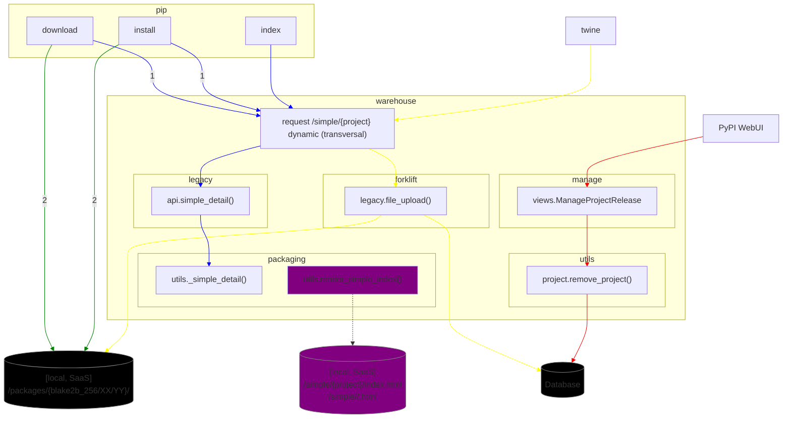

# General TUF Warehouse implementation Notes

## Current Warehouse and tools (pip, twine, WebUI) flow investigation

### twine
  1. post resquest ``/simple/{project}`` and file name to Warehouse
  2. Warehouse proceed with validations
  3. Warehouse uses the ``forklift.legacy.file_upload()`` and writes in the
  ``db`` and ``Storage[/packages/{blakeb_256/XX/YY}/{filename}]``


### PyPI WebUI

  1. from the ``manage.views.ManageProjectRelease()`` request to remove the a
  release version using the ``utils.project.remove_project()``
  2. The file is deleted from ``db``, but not from the `Storage[/packages]`

### PIP
Using diferent commands ``pip <command>``

#### index
  1. Request ``/simple/{project}``
  2. Warehouse render dynamically the index
  ``legacy.api.simple_detail()`` -> ``packaging.utils.simple_details()``
  if the project exists.

#### download
  1. Call ``pip index``
  2. Look for the latest version in the simpleindex and request from
  ``Storage[/packages/{blakeb_256/XX/YY}/{filename}]``

#### install
  1. Call ``pip index``
  2. Call ``pip install``
  3. Look into the dependencies
  4. loop for the dependencies
  ```mermaid
    sequenceDiagram
        participant pip
        participant warehouse
        pip->>warehouse: simple/<project_name>
        warehouse-->>pip: 404, simple index not found
        warehouse->>pip: 200, simple index
        loop look in the index
          pip->>pip: Get latest <package> version or specific version
        end
        pip->>warehouse: Get specific version /packages/{blake2b_256/XX/YY}/<package>
        warehouse-->pip: 404, <package> not found
        warehouse->>pip: 200, <package>
        pip->>pip: Looking for dependencies  <package> dependencies
  ```


## General flows on Warehouse


- Recently was merge [PR 458](https://github.com/pypa/warehouse/pull/8586), that 
enables the persistent index for Simple Details. 

## TUF WIP

The current work on Warehouse is a refactoring from the
[Draft PR](https://github.com/pypa/warehouse/pull/7488) using the old 
``python-tuf`` repository tools.

The mentioned repository tools are no longer available on the latest version.

The idea is to start implementing small PRs to evaluate and progress.

### Current status

- Implemented the new repository tool using the new python-tuf Metadata API.

  Repository tool Design overview:
  - The repository ``warehouse.tuf.repository.MetadataRepository`` management
   tool was created standalone, not as ``zope.interface.Interface``.
  
    The reason is that if a better Metadata Repository management implementation
    is available in the future, it could be replaced easily.
    
    Also, the ``MetadataRepository`` does not need to support different
    implementations such as SaaS once the ``StorageService`` is enough.

  - The ``IStorageService`` was used in the 
  ``warehouse.tuf.repository.MetadataRepository`` as backend storage.

  - The ``warehouse.cli.tuf`` calls goes through ``warehouse.cli.tasks``, meaning
  that all calls goes trough Celery.


  ```mermaid
    classDiagram 
      direction LR
      class MetadataRepository {
        <<tuf.repository>>
        +storage_backend
        +key_backend
        initialize()
        load_role()
        bump_role_version()
        timestamp_bump_version()
        snapshot_bump_version()
        snapshot_update_meta()
        delegate_targets_roles()
        add_targets()
      }
      class `tuf.interfaces` {
        zope.interface.Interface
        IKeyService(Interface)
        IStorageService(Interface)
        IRepositoryService(Interface)
      }
      class `tuf.services` {
        IKeyService
        IRepositoryService
        IStorageService        
        LocalKeyService(IKeyService)
        LocalStorageService(IStorageService)
        LocalRepositoryService(IRepositoryService)
      }
      class `tuf.tasks` {
        init_repository
        delegate_targets_bin_bins
        bump_snapshot
        bump_bin_n_roles
        add_hashed_targets
      }

      class `cli.tuf`{
          dev keypairs
          dev new-repo
          dev add-targets
          admin delegate-targets
          admin bump-snapshot
          admin bump-bin-ns
      }


      `tuf.services` <|-- `tuf.interfaces`
      `tuf.services` --* MetadataRepository
      `tuf.tasks` -- `tuf.services`
      `cli.tuf` -- `tuf.tasks`
      warehouse -- `cli.tuf`
      warehouse -- `tuf.tasks`
  ```

- Implemented Services/Interfaces for Storage and Storage Keys
- Implemented TUF CLI
  - Development Commands
    - Generate Key Pairs for the roles
    - Initialize the TUF Repository (keys and metadata) for Development
    - Add targets files (Packages from Database)
  - Administrative Commands
    - Generate the delegations Roles and Hashed bin roles (bins and bin-n)
    - Bump snapshot
    - Bump delegate bin-n hashed bin targets roles
- Tasks
  - Update Snapshot role metadata
  - Update delegated hash bin roles (bin-n) and their delegations

It's is possible use the new ``python-tuf`` client (ngclient) to download the
target.


### Next steps:

- [ ] Polish the new Warehouse metadata repository tool
- [ ] Publish the new Draft PR
  
  Goals:
  - Limited for enabling tuf Metadata on development environment
  - Intent to validate the Metadata Repository tool

- [ ] PR to implement the simple detail index to the Metadata

- [ ] PR to implement the TUF in the Warehouse request flow
    - upload target file
    - delete target file
    - tasks for refreshing indexes/projects


## Using the Warehouse development environment for TUF

Follow the official Warehouse until ``make initdb``

```shell
$ make inittuf
```

The metadata is available at http://localhost:9001/metadata/

You can also upload a file using the Warehouse and add the targets using CLI
- Create a user [using Web UI](https://warehouse.pypa.io/development/getting-started.html#viewing-warehouse-in-a-browser)
- Validate the [email](https://warehouse.pypa.io/development/email.html)
- Upload file using ``twine``

```shell
docker-compose run --rm web python -m warehouse tuf dev add-targets
```
